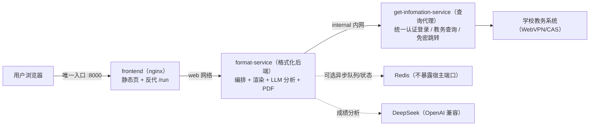

# 教务查询编排 · Stpt-Query

> 把固定的 Dify 工作流重写为三容器编排服务：查询代理 + 格式化后端 + 前端，不再依赖 Dify。


[](https://www.python.org/)
[](https://fastapi.tiangolo.com/)
[](https://www.docker.com/)
[](https://nginx.org/)
[](https://redis.io/)
[](https://daringfireball.net/projects/markdown/)

## 目录

- [关于](#关于)
- [技能栈](#技能栈)
- [项目](#项目)
- [架构](#架构)
- [与 Dify 工作流的映射](#与-dify-工作流的映射)
- [当前目标](#当前目标)
- [路线图](#路线图)
- [快速开始](#快速开始)
- [测试](#测试)
- [Kubernetes 迁移就绪](#kubernetes-迁移就绪)
- [仓库结构](#仓库结构)
- [许可](#许可)

## 关于

本仓库把固定的「汕职院教务信息查询」Dify 工作流重写为自包含项目，由三个容器组成：`get-infomation-service`（查询代理）、`format-service`（格式化后端）与 `frontend`（前端）。查询代理源码保留在本仓库完成学校统一认证登录与教务查询；格式化后端负责编排固定工作流、成绩/课表渲染、成绩分析 LLM 与 PDF；前端托管原 dify-workflow-api 的完整页面，是唯一对外入口。

| 项目 | 内容 |
| --- | --- |
| 身份 | 教务查询编排服务（替代 Dify 工作流） |
| 方向 | 教育信息化 · 教务数据服务 |
| 方式 | 三容器编排 + 统一身份认证（WebVPN/CAS）+ OpenAI 兼容 LLM |
| 目标 | 不依赖 Dify 地为页面与自动化脚本提供稳定、可扩展的教务查询接口 |

## 技能栈

| 领域 | 内容 |
| --- | --- |
| 后端编排 | Python 3.11 · FastAPI + uvicorn · httpx（登录/跳转/成绩/课表编排与错误分类） |
| 渲染与文档 | Markdown 渲染（1:1 移植原代码节点）· reportlab PDF（内置 CID 中文字体） |
| LLM | OpenAI 兼容协议直连（默认智谱 `glm-4.5-flash`，可关闭深度思考并覆盖系统提示词） |
| 前端 | Nginx 静态页面 + Tailwind CSS 4 品牌令牌（构建期 CLI 编译、运行时零第三方资源）+ 反向代理注入网关令牌 |
| 部署 | Docker Compose 三容器 · 双层网络隔离 · 可选 Redis（多副本） |
| 测试与文档 | pytest 单元测试 · K8s 迁移指引 |

## 项目

| 项目 | 简介 | 技术栈 | 状态 |
| --- | --- | --- | --- |
| [查询代理](get-infomation-service/) | 本仓库内嵌的 get-infomation-service：统一认证登录、免密跳转、成绩/课表查询 | Python · FastAPI · Redis | 活跃 |
| [格式化后端](format-service/) | 编排固定工作流：查询代理调用、成绩/课表渲染、成绩分析 LLM、PDF | Python · FastAPI · httpx · reportlab | 活跃 |
| [前端](frontend/) | Nginx 托管原 dify-workflow-api 页面并反向代理 /run 等接口 | Nginx | 活跃 |

## 架构



**端口与网络隔离**：仅 `frontend` 映射宿主端口 `8000`（容器内为无特权 `8080`）；`format-service` 挂 `web` 与 `internal` 两个网络；`get-infomation-service` 只挂 `internal` 内网——宿主与前端都无法直达查询代理，只能通过格式化后端在编排内调用。

## 与 Dify 工作流的映射

| Dify 节点 | 实现 |
| --- | --- |
| 开始节点 | `format-service/app/schema.py::WorkflowRequest` |
| HTTP 节点 ×4 | `format-service/app/pipeline.py` 调查询代理 |
| 代码节点 ×6 | `format-service/app/render.py`（1:1 移植） |
| 成绩分析 LLM | `format-service/app/llm.py` + `prompts.py` |
| 报错解析 LLM ×4 | `format-service/app/classifier.py` 确定性规则 |
| 变量聚合器 | 分支返回值（已消除登录响应泄漏） |
| md_exporter / file_tools | `format-service/app/pdf.py` + 内联 Base64 PDF |
| sys.workflow_run_id | `format-service/app/trace.py::new_run_id` |
| 3 个 END | `format-service/app/schema.py::QueryResult` 单一体 |

## 异步查询任务

`POST /run/jobs` 用于高峰排队。接口先同步完成学校登录，把密码换成查询代理的短期
session/任务票据，然后立即返回 `job_id`；队列、去重键、任务状态和结果都保存在 Redis。
**Redis 队列不保存密码**，任务负载不含明文凭据；日志和轮询响应也不返回 session 或 token。

```text
POST /run/jobs        请求体与 POST /run 相同，返回 {job_id, state, position, poll_url}
GET  /run/jobs/{id}   state=queued/running/success/failed；终态携带 result
```

- 轮询响应包含 `phase`、`phase_index`、`phase_label` 和 `phase_started_at`。阶段依次为
  `queued`（排队）、`dispatching`（等待查询槽位）、`querying`（查询成绩/课表）、
  `analyzing`（成绩分析，可选）、`generating_pdf`（生成 PDF，可选）和 `done`（完成）。
  登录校验在 `/run/jobs` 受理前同步完成，因此拿到 `job_id` 时登录步骤已完成。
- `JOB_WORKERS` 是每个 format-service 副本的消费协程数；总活跃任务约为副本数 × worker 数，
  并继续受 `GLOBAL_CONCURRENCY`、`LLM_CONCURRENCY`、`PDF_CONCURRENCY` 和查询代理上游
  信号量保护。
- 同一学号 + 查询参数在排队/执行中自动去重；终态结果按 `JOB_RESULT_TTL_SECONDS` 保留。
- Redis 未配置时接口返回 503；前端识别未启用后会回退旧 `POST /run`，默认三容器部署不变。
- 编排内 Redis 由 `.env` 的 `COMPOSE_PROFILES` 控制：设为 `redis` 时启动，留空时不启动。
  启用后同步设 `REDIS_URL=redis://redis:6379/0`、`JWXT_REDIS_URL=redis://redis:6379/1`，
  再执行 `docker compose up -d --build`。使用外部 Redis 时保持 `COMPOSE_PROFILES=` 留空，
  并把两个 URL 改成外部地址。Redis 仅挂 internal 网络且不映射宿主端口。

## 查询日志与可观测性

`format-service` 为每次查询输出**结构化 JSON 单行日志**（stdout），并保留最近 100 条到
内存环形缓冲。配置 `REDIS_URL` 时写入 `gw:query-logs`；启用 `FILE_LOG_ENABLED` 后
同时以 JSONL 追加到 `FILE_LOG_PATH`，供文件与 Redis 双写留存。日志字段：

| 字段 | 说明 |
| --- | --- |
| `event` | 固定 `query`（限流命中为 `rate_limited`） |
| `time` / `run_id` | 发生时间（含时区）/ 贯穿本次查询的 32 位运行 ID |
| `client_ip` | 客户端地址（`TRUST_PROXY=true` 时取 `X-Forwarded-For` 首段） |
| `username` / `option` | 学号 / 查询项目 |
| `semesters` / `weeks` / `md2pdf` / `check` | 查询参数 |
| `analysis` / `analysis_usage` | 成绩分析是否产出内容 / 消耗的总 token 数；无用量时为 `—` |
| `success` / `kind` / `elapsed_ms` | 结果状态、分类与耗时 |
| `response_summary` | 上游成功或失败响应的脱敏摘要，最多 300 字符；无摘要时为 `—` |

- 日志**不包含**密码 / session / token；白名单字段之外一律丢弃（`app/querylog.py`）。
- 文件通道只保留白名单字段，权限为 `0600`；按 `FILE_LOG_MAX_BYTES` 轮转并最多保留
  `FILE_LOG_BACKUP_COUNT` 个备份。Compose 默认挂载具名持久卷，容器与 Docker daemon
  重启后日志保留；更长期的审计与检索建议接入集中日志平台。
- 业务编排数据仍不落盘；文件卷只承载查询日志（服务状态从 `event=query` 记录派生）。
  Redis 与文件互为冗余，任一失败不影响 `/run` 和另一条通道；最近一次文件错误可通过
  `/health` 观察。
- `/query-logs` 包含用户学号，不对外暴露；仅可从内部网络运维查看，例如
  `docker compose exec format-service curl -H "Authorization: Bearer $API_TOKEN" http://127.0.0.1:8000/query-logs`；
  生产建议经集中日志查询，不长期依赖进程内存。
- 公开站通过 `GET /health/public` 获取本站、查询代理和学校服务的粗粒度状态；
  接口只返回状态、延迟和检查时间，不暴露内部地址、错误详情或凭据，结果缓存 15 秒。
- `GET /service-status` 返回最近 100 次查询的 `success/kind/time`，同一实例的所有客户端
  共享相同历史；配置 Redis 后跨副本共享，重启后从持久 JSONL 日志恢复。响应不包含
  学号、IP、错误详情等查询日志上下文。

### 管理后台

打开 `/admin` 后输入独立 `ADMIN_TOKEN`；`ADMIN_TOKEN` 留空时后台 API 完全禁用。
Nginx 对 `/admin/api/*` 原样透传管理员 Authorization，不注入公共网关令牌；因此查询用户无法访问。

- `GET /admin/api/query-logs` 支持关键字、成功状态、分类、项目、时间范围和分页；
  文件通道启用时默认按新→旧扫描最近 5000 行（`scan_limit=0` 全量），降低大日志
  带来的内存/CPU 尖峰；未启用时降级 Redis/内存最近记录。
- 响应返回匹配总数、成功率、失败分类和数据源。日志仍先经过白名单脱敏，页面只在当前
  标签页的 `sessionStorage` 中保留管理员凭据，退出即清除。
- `GET /admin/api/metrics` 暴露容器 CPU、内存/RSS、日志磁盘、网络累计、运行时长、
  宿主机 CPU/内存/负载/磁盘 I/O/网络、日志文件存储增长和应用近 5 分钟负载；
  编排内存按 format-service、查询代理、前端入口三个 cgroup 聚合，宿主 cgroup
  不可读时按进程 RSS 估算并在界面标注；
  并发与限流配置；后台 UI 每 5 秒刷新并绘制近三分钟 CPU 趋势（每 2 秒采样一次）。
- 管理端是单实例运维视图：读取当前副本文件和本地进程指标；Redis 仅在无文件通道时作
  历史降级源。生产多副本应继续把 stdout 交给集中平台聚合分析。
- nginx 使用不含 query string 的隐私访问日志；携带个人票号的 `/jump/go` 与 `/get_schedule/export`
  不写 access log。边缘响应启用 CSP、反点击劫持与 Referrer 隔离，本地历史结果只保留 6 小时。
- Compose 默认启用内存/PID 护栏：Python 服务 `256m / 64 PIDs`，Nginx `64m / 32 PIDs`，
  并设置 `MALLOC_ARENA_MAX=2`；内存模式查询代理默认最多 1000 个会话与每类 1000 条缓存。

## 可靠性与过载保护

- `format-service` 对 `/run` 设置全局并发槽位（默认 4）和等待超时；满载返回 HTTP 503。
- 单次编排有总预算（默认 100 秒），避免学校上游或 LLM 故障长期占用连接。
- `REDIS_URL` 配置后使用固定窗口共享限流；Redis 不可用时 `/run` 失败关闭，防止限流旁路。
- 异步任务使用 Redis 排队和去重；`JOB_PENDING_LIMIT` 限制全局排队，worker 使用查询、LLM
  和 PDF 独立槽位，避免 500 个任务同时穿透到学校、模型或 CPU。
- 前端 Nginx 使用多 worker 与 4096 连接，静态响应压缩/短缓存；`/run` 与任务轮询响应不缓存。

## 当前目标

| 目标 | 说明 | 期限 |
| --- | --- | --- |
| 真实账号端到端验收 | 用真实学号/密码跑通成绩、课表、成绩分析、PDF 四条链路 | 未定 |

## 路线图

- 近期：真实账号端到端验收；异步任务多副本压测与学校上游安全并发标定
- 中期：查询日志接入集中式日志平台；Prometheus 指标告警；HTTPS 与密钥轮换
- 远期：扩展成绩分析能力与可复用编排方案沉淀

## 构建加速与镜像源（可选）

国内环境可经环境变量切换基础镜像与依赖下载源，无需修改 Dockerfile：

```bash
# .env 中配置（示例）
IMAGE_REGISTRY=docker.m.daocloud.io          # 基础镜像加速站
PIP_INDEX_URL=https://pypi.tuna.tsinghua.edu.cn/simple  # PyPI 镜像
```

> `PIP_INDEX_URL` 只接受 PyPI 兼容镜像；`registry.npmmirror.com` 是 npm 源，
> 会导致 `pip install` 报“versions: none”。

> 全部环境变量、默认值与说明以 [`.env.example`](.env.example) 为唯一事实来源
> （含 `SERVICE_BASE_URL`、`TRUST_PROXY`、`REDIS_URL`、`TZ`、`LLM_TIMEOUT` 等），README 不重复维护。

前端样式需要重新编译时，npm 源可在构建前单独切换（产物已预编译提交，普通部署无需 npm）：

```bash
cd frontend
npm config set registry https://registry.npmmirror.com   # 可选：npm 镜像
npm install && npm run build
```

开发环境清理（全部可再生，不影响运行）：

```bash
rm -rf frontend/node_modules .venv .pytest_cache format-service/app/__pycache__ tests/__pycache__
```

## 快速开始

```bash
cp .env.example .env      # 填写 SERVICE_API_TOKEN / LLM_API_KEY（可选），务必修改 API_TOKEN
docker compose up -d --build
# 浏览器打开 http://127.0.0.1:8000

# 启用编排内 Redis 和异步排队时，在 .env 设 COMPOSE_PROFILES=redis、
# REDIS_URL=redis://redis:6379/0 和 JWXT_REDIS_URL=redis://redis:6379/1，然后：
docker compose up -d --build
```

> `PUBLIC_BASE_URL` 为浏览器可访问的对外入口地址，用于生成免密登录 `/jump/go` 与课表下载
> `/get_schedule/export` 链接（本地默认 `http://127.0.0.1:8000`，生产改成公网域名）。
> `APP_PORT` 控制 frontend 映射到宿主机的唯一端口；修改后需同步 `PUBLIC_BASE_URL`。
>
> 若 `frontend` 前还有外层 Nginx/Caddy 等反代，把 `TRUSTED_PROXY_CIDR` 改成该反代
> 连接本服务时的来源 IP/CIDR；nginx 只信任该来源的 `X-Forwarded-For` 并恢复真实客户端 IP。

> 前端令牌样式已预编译提交（`frontend/static/style.css`），普通部署无需 npm；修改
> 样式后重新构建：`cd frontend && npm install && npm run build`。

> 品牌文案（标题 / slogan / 页脚作者与 GitHub 链接）可由环境变量 `BRAND_NAME`、
> `BRAND_SLOGAN`、`BRAND_DESCRIPTION`、`BRAND_AUTHOR`、`BRAND_GITHUB` 覆盖；留空即使用
> `frontend/static/brand.js` 的内置默认值，`BRAND_GITHUB=none` 隐藏页脚 GitHub 链接。

> 前端与 `format-service` 共用固定 `API_TOKEN`（默认 `change-me`），由 nginx 反代时注入 `Authorization` 头，浏览器页面不持有令牌；`SERVICE_API_TOKEN` 必须与 `get-infomation-service` 的 `JWXT_API_TOKEN` 一致。生产环境必须把 `PUBLIC_BASE_URL` 改成 HTTPS 域名。

## 测试

```bash
pip install -r requirements-dev.txt
pytest
# 或容器内：
docker build -t format-service:test format-service
docker run --rm -v "$PWD":/app -w /app format-service:test \
  sh -c "pip install -q pytest pytest-asyncio && python -m pytest -q"

# 前端令牌构建（Tailwind CSS 4 同栈，产物自托管）
cd frontend && npm install && npm run build
```

## Kubernetes 迁移就绪

当前不随仓库附带 `k8s/` 清单，但已按未来可迁入 K8s 设计（无状态、环境变量配置、`/health/live` + `/health/ready` 探针、固定 API Token、PDF 内联无 PV）。详见 [docs/kubernetes-migration.md](docs/kubernetes-migration.md)。

## 仓库结构

```text
Stpt-Query/
├── get-infomation-service/    # 查询代理源码（登录/跳转/原始查询）
├── format-service/            # 格式化后端（编排 + 渲染 + 分析 + PDF）
│   ├── app/main.py            # HTTP 层：/run /query-logs /health* /service-status
│   ├── app/metrics.py         # 容器 CPU/内存/磁盘/网络资源监控
│   ├── app/pipeline.py        # 固定工作流编排
│   ├── app/render.py          # 成绩/课表渲染（原代码节点移植）
│   ├── app/classifier.py      # 确定性异常分类
│   ├── app/llm.py             # OpenAI 兼容 LLM 客户端
│   ├── app/pdf.py             # Markdown→PDF
│   ├── app/prompts.py         # 成绩分析提示词
│   ├── app/schema.py          # 请求/响应模型
│   ├── app/querylog.py        # 查询日志（结构化 JSON、脱敏、可选文件轮转）
│   ├── app/trace.py           # run_id 与日志
│   ├── Dockerfile             # python:3.11-slim 镜像
│   └── requirements.txt
├── frontend/                  # 前端（nginx，唯一对外入口）
│   ├── templates/default.conf.template  # 反代 /run 等并注入令牌
│   ├── static/index.html      # 查询页面（Li-Design 令牌重构）
│   ├── static/style.css       # Tailwind CSS 4 编译产物（自托管）
│   ├── static/brand.js        # 品牌单点（名称/slogan/页脚/备案占位）
│   ├── static/image/          # 站点图标
│   ├── src/index.css          # 令牌源（+ app.css，模板实例化）
│   └── package.json           # npm run build 重新编译样式
├── design-system/edu-query-app/   # 项目内品牌方案（BRAND/MASTER，设计事实）
├── tests/                     # pytest（渲染/分类/编排/HTTP/查询日志）
├── docs/kubernetes-migration.md   # K8s 迁移指引
├── Li-Design/                 # Git 子模块：仅设计/README 规范参考，非运行时依赖
├── docker-compose.yml         # 三容器 + 双层网络编排
├── .env.example               # 环境变量模板
├── AGENTS.md                  # 项目协作手册
├── requirements-dev.txt       # 开发依赖
├── pyproject.toml             # 项目元信息 + pytest 配置
└── README.md                  # 项目说明（本文件）
```

## 许可

© 2026 Lzf07123。保留所有权利。
