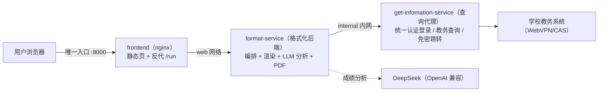

# edu-query-app · 教务查询编排（三容器）

> 把固定的 Dify 工作流重写为独立项目，不再依赖 Dify。
> 由三个容器组成：**get-infomation-service（查询代理）+ format-service（格式化后端）+ frontend（前端）**。

## 架构



**端口与网络隔离**：仅 `frontend` 映射宿主端口 `8000`；`format-service` 挂 `web` 与
`internal` 两个网络；`get-infomation-service` 只挂 `internal` 内网——宿主与前端都
无法直达查询代理，只能通过格式化后端在编排内调用。

| 容器 | 目录 | 职责 |
|---|---|---|
| get-infomation-service | `../STPT-Query/get-infomation-service`（复用现有服务） | 学校统一认证登录、免密跳转、成绩/课表查询，会话/缓存/限流 |
| format-service | `format-service/` | 编排固定工作流：调用查询代理 → 成绩/课表渲染 → 可选成绩分析 LLM → 可选 PDF |
| frontend | `frontend/` | nginx 静态前端 + 反向代理 `/run`、`/service-status`、`/health*` |

## 与 Dify 工作流的映射

| Dify 节点 | 实现 |
|---|---|
| 开始节点 | `format-service/app/schema.py::WorkflowRequest` |
| HTTP 节点 ×4 | `format-service/app/pipeline.py` 调查询代理 |
| 代码节点 ×6 | `format-service/app/render.py`（1:1 移植） |
| 成绩分析 LLM | `format-service/app/llm.py` + `prompts.py` |
| 报错解析 LLM ×4 | `format-service/app/classifier.py` 确定性规则 |
| 变量聚合器 | 分支返回值（已消除登录响应泄漏） |
| md_exporter / file_tools | `format-service/app/pdf.py` + 内联 Base64 PDF |
| sys.workflow_run_id | `format-service/app/trace.py::new_run_id` |
| 3 个 END | `format-service/app/schema.py::QueryResult` 单一体 |

## 快速开始

```bash
cp .env.example .env      # 填写 SERVICE_API_TOKEN / LLM_API_KEY（可选）
docker compose up -d --build
# 浏览器打开 http://127.0.0.1:8000
```

> `SERVICE_API_TOKEN` 必须与 `get-infomation-service` 的 `JWXT_API_TOKEN` 一致；
> 若生产部署在独立服务器，`SERVICE_BASE_URL` 指向已部署的查询代理。

## 环境变量

见 `.env.example`。生产环境必须 `ENVIRONMENT=production`、`AUTO_ROTATE_TOKEN=false`
并配置固定 `API_TOKEN`（多副本一致）。

## 测试

```bash
pip install -r requirements-dev.txt
pytest
# 或容器内：
docker build -t format-service:test format-service
docker run --rm -v "$PWD":/app -w /app format-service:test \
  sh -c "pip install -q pytest pytest-asyncio && pytest -q"
```

## Kubernetes 迁移就绪

当前不随仓库附带 `k8s/` 清单，但已按未来可迁入 K8s 设计（无状态、环境变量配置、
`/health/live` + `/health/ready` 探针、固定 API Token、PDF 内联无 PV）。
详见 [docs/kubernetes-migration.md](docs/kubernetes-migration.md)。

## 路线图

- [ ] 多实例后台任务队列（异步 `/run/{id}` 轮询兼容）
- [ ] LLM 异常诊断兜底（规则未命中时）
- [ ] Prometheus 指标与告警
- [ ] 前端完整移植与 PDF 内联预览
