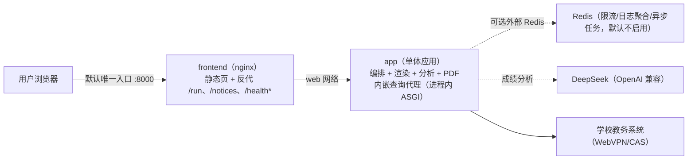

# 教务查询编排 · Stpt-Query

> 把固定的 Dify 工作流重写为**单体应用 + 边缘代理**：查询、渲染、分析、PDF 与内嵌查询代理同进程运行，不再依赖 Dify。


[](https://www.python.org/)
[](https://fastapi.tiangolo.com/)
[](https://www.docker.com/)
[](https://nginx.org/)
[](https://daringfireball.net/projects/markdown/)

## 目录

- [关于](#关于)
- [技能栈](#技能栈)
- [项目](#项目)
- [架构](#架构)
- [与 Dify 工作流的映射](#与-dify-工作流的映射)
- [当前目标](#当前目标)
- [路线图](#路线图)
- [快速开始](#快速开始)
- [测试](#测试)
- [Kubernetes 迁移就绪](#kubernetes-迁移就绪)
- [仓库结构](#仓库结构)
- [许可](#许可)

## 关于

本仓库把固定的「汕职院教务信息查询」Dify 工作流重写为自包含项目，由两个容器组成：`app`（单体应用）与 `frontend`（前端）。查询代理已并入 `app/` 包，以**进程内 ASGI** 方式被调用，负责学校统一认证登录、免密跳转与成绩/课表原始查询；编排层负责固定工作流、成绩/课表渲染、成绩分析 LLM、异常分类与 PDF；前端托管原 dify-workflow-api 的完整页面，是默认唯一对外入口。

| 项目 | 内容 |
| --- | --- |
| 身份 | 教务查询编排服务（替代 Dify 工作流） |
| 方向 | 教育信息化 · 教务数据服务 |
| 方式 | 单体应用 + 边缘代理（2 容器）+ 统一身份认证（WebVPN/CAS）+ OpenAI 兼容 LLM |
| 目标 | 不依赖 Dify 地为页面与自动化脚本提供稳定、可扩展的教务查询接口 |

## 技能栈

| 领域 | 内容 |
| --- | --- |
| 后端编排 | Python 3.11 · FastAPI + uvicorn · httpx（登录/跳转/成绩/课表编排与错误分类） |
| 渲染与文档 | Markdown 渲染（1:1 移植原代码节点）· reportlab PDF（内置 CID 中文字体） |
| LLM | OpenAI 兼容协议直连（默认智谱 `glm-4.5-flash`，可关闭深度思考并覆盖系统提示词） |
| 前端 | Nginx 静态页面 + Tailwind CSS 4 品牌令牌（构建期 CLI 编译、运行时零第三方资源）+ 反向代理注入网关令牌 |
| 部署 | Docker Compose 两容器（app + frontend）· 单实例默认无 Redis · 内嵌查询代理（免内部网络/内部令牌） |
| 测试与文档 | pytest 单元测试 · K8s 迁移指引 |

## 项目

| 项目 | 简介 | 技术栈 | 状态 |
| --- | --- | --- | --- |
| [单体应用](app/) | 固定工作流编排 + 成绩/课表渲染 + 成绩分析 LLM + PDF + 内嵌查询代理（登录/免密跳转/原始查询） | Python · FastAPI · httpx · reportlab · LibreOffice | 活跃 |
| [前端](frontend/) | Nginx 托管原 dify-workflow-api 页面并反向代理 /run 等接口 | Nginx | 活跃 |

## 架构



**默认端口与网络隔离**：仅 `frontend` 映射宿主端口 `8000`（容器内为无特权 `8080`）；`app` 只在 `web` 网络内暴露 `8000`，不映射宿主端口。查询代理不再有独立进程与端口——它在 `app` 进程内以 ASGI 方式调用，宿主与前端都无法直达，也不再需要内部网络与内部令牌。

### 服务边界与可选直连

| 容器 | 职责边界 | 默认网络 | 对外契约 |
| --- | --- | --- | --- |
| `frontend` | 静态页面、CSP/安全响应头、注入网关令牌并反代 API | `web` | `APP_PORT` 上的页面和受代理 API |
| `app` | 固定工作流编排、成绩/课表渲染、LLM、PDF、日志、异步任务，以及内嵌查询代理（统一认证/会话/免密跳转/原始查询/课表导出） | `web` | Bearer `API_TOKEN` 保护 `/run`、`/notices*`；`/health*` 与 `/service-status` 有公开/受限契约 |

默认编排保持“只有 frontend 暴露宿主端口”。需要直连 `app` 做验收时，自行创建 override：

```yaml
# compose.direct-app.yml（自行创建；默认绑定宿主回环，且必须关闭代理信任）
services:
  app:
    ports:
      - "127.0.0.1:18080:8000"
    environment:
      - TRUST_PROXY=false
```

```bash
docker compose -f docker-compose.yml -f compose.direct-app.yml up -d --no-deps app
curl -s http://127.0.0.1:18080/health/ready
```

若把直连地址从 `127.0.0.1` 改为 `0.0.0.0`，必须自行补上 TLS、防火墙、反向代理与最小来源访问控制；
`/metrics` 等运维接口只适合回环或内网访问。

## 与 Dify 工作流的映射

| Dify 节点 | 实现 |
| --- | --- |
| 开始节点 | `app/schema.py::WorkflowRequest` |
| HTTP 节点 ×4 | `app/pipeline.py` 调用内嵌查询代理（进程内 ASGI） |
| 代码节点 ×6 | `app/render.py`（1:1 移植） |
| 成绩分析 LLM | `app/llm.py` + `prompts.py` |
| 报错解析 LLM ×4 | `app/classifier.py` 确定性规则 |
| 变量聚合器 | 分支返回值（已消除登录响应泄漏） |
| md_exporter / file_tools | `app/pdf.py` + 内联 Base64 PDF |
| sys.workflow_run_id | `app/trace.py::new_run_id` |
| 3 个 END | `app/schema.py::QueryResult` 单一体 |

## 异步查询任务

`POST /run/jobs` 用于高峰排队。接口先同步完成学校登录，把密码换成短期
session/任务票据，然后立即返回 `job_id`；队列、去重键、任务状态和结果都保存在 Redis。
**Redis 队列不保存密码**，任务负载不含明文凭据；日志和轮询响应也不返回 session 或 token。

> 单体默认拓扑**不内置 Redis**（单实例、同步查询）。`/run/jobs` 会返回 503 并说明
> 「异步查询未启用」，前端自动回退到 `POST /run`。需要异步排队或多副本时，自备外部
> Redis 并设置 `REDIS_URL`（查询代理侧可同时设置 `JWXT_REDIS_URL`）。

```text
POST /run/jobs        请求体与 POST /run 相同，返回 {job_id, state, position, poll_url}
GET  /run/jobs/{id}   state=queued/running/success/failed；终态携带 result
```

- 轮询响应包含 `phase`、`phase_index`、`phase_label` 和 `phase_started_at`。阶段依次为
  `queued`（排队）、`dispatching`（等待查询槽位）、`querying`（查询成绩/课表）、
  `analyzing`（成绩分析，可选）、`generating_pdf`（生成 PDF，可选）和 `done`（完成）。
  登录校验在 `/run/jobs` 受理前同步完成，因此拿到 `job_id` 时登录步骤已完成。
- `JOB_WORKERS` 是消费协程数；总活跃任务继续受 `GLOBAL_CONCURRENCY`、`LLM_CONCURRENCY`、
  `PDF_CONCURRENCY` 与内嵌查询代理上游信号量保护。
- 同一学号 + 查询参数在排队/执行中自动去重；终态结果按 `JOB_RESULT_TTL_SECONDS` 保留。
- Redis 未配置或运行中不可用时，异步受理返回 503；前端识别后会回退 `POST /run`，
  默认单体部署（单实例、无 Redis）即为此模式。

## 网络日历订阅（只读 ICS）

把课表订阅到手机 / 电脑日历：**页脚常驻入口**可查询某个学号是否已开启、一键开启并复制订阅地址、
随时关闭；**课表查询成功后**结果区会直接显示订阅状态（未开启 / 已开启 / 需重新授权）。

| 入口 | 说明 |
| --- | --- |
| 页脚「📅 网络日历订阅」 | 复用页面上的学号与密码（仅内存，不写 localStorage）查询状态、开启、刷新、轮换、关闭 |
| 课表结果区 | 查询成功即显示状态；密码刚被学校接受时为零额外登录的权威判定 |
| 后台「网络日历」标签页 | 列出已开启的学号、状态、刷新间隔与失败次数；支持按学号查询、立即刷新、暂停/恢复、轮换地址、彻底删除（**不展示完整订阅地址**） |

### 添加到日历（设备识别 + 一键导入）

订阅地址是长期密钥，因此页面在**默认掩码**的前提下提供「添加到日历」指引：

- **设备/浏览器识别**：区分 iPhone / iPad / Android / macOS / Windows / Linux，并识别微信、QQ、
  钉钉、支付宝、飞书等**内置浏览器**。命中内置浏览器时会提示「在浏览器中打开」，或改用扫码；
- **一键导入**（本地方式，订阅地址不经第三方服务器）：
  - Apple 设备 / macOS：`webcal://` 交给系统「日历」并询问是否订阅；
  - Windows：`webcal://` 交给 Outlook / 系统日历；
  - Android：Google 日历网页版添加链接（会标注为第三方抓取），
    以及 `navigator.share` 分享 `.ics` 给已安装的日历 App（华为/小米/OPPO/vivo 等）；
  - 通用回退：复制订阅地址、下载 `.ics`（一次性导入，**不会自动更新**）；
- **唤起结果检测**：点击 `webcal` 后若页面在 1.5 秒内仍未失焦，则判定没有对应日历 App 并提示改用其他方式，
  不谎称「已添加成功」；
- **扫码订阅**：显式点击「生成扫码图像」后由服务端本地编码（复用已有 reportlab，不经任何第三方二维码/短链服务），
  前端按设备像素比在 canvas 上绘制 `webcal://` 二维码；关闭面板即清除已生成的二维码；
- **第三方提示**：Google 日历、Outlook 网页版会让对应服务端抓取订阅地址（地址即密钥），UI 中明确标注，
  由用户决定是否接受。

### 刷新语义（重要）

- **服务端**按订阅的刷新间隔（默认 12 小时，下限 1 小时）重新登录学校并重建快照；
- **客户端**何时来拉取由日历软件决定：Apple 日历较尊重 `REFRESH-INTERVAL`，Google 通常每天
  抓取一次，Outlook 常 ≥3 小时且不可配置；
- 因此课表变更通常需要数小时才能同步到日历，急用请在面板点「立即刷新」。

### 安全与数据

- 学校凭据以 **AES-GCM** 加密存储（密钥 `CALENDAR_MASTER_KEY`，必须固定且与备份分开保管）；
  学号以 HMAC 索引，静态泄露不暴露学号；
- 订阅地址是长期密钥：服务端只存 **token 哈希 + 加密副本**（加密副本仅用于已授权回显），
  支持轮换与关闭；`/cal/` 在 nginx 关闭访问日志，也不注入网关令牌；应用侧访问日志
  （uvicorn `uvicorn.access`）同样把 `/cal/<token>.ics` 掩码为 `/cal/[redacted].ics`，
  并有回归测试保护；
- **关闭订阅 = 立即删除加密凭据与课表快照**，地址失效（404）；已同步到手机/日历软件的事件
  需在客户端自行删除；
- 连续 3 次凭据失败会暂停刷新 24 小时并提示重新授权，避免反复撞学校风控；
- ICS 正文只含课程名 / 教师 / 教室 / 周次，**不含学号、姓名、学院、专业、班级**。

### 维护节次与学期

`config/calendar.json` 是节次时间表与学期基准的唯一事实来源（非机密、随仓库版本管理）：

- `periods`：每节课的起止时间（第 11 节 20:50–21:35 为推算值，已标注 `inferred`）；
- `block_codes`：学校时段编码（`1_2`/`3_4`/`5_6`/`7_8`/`9_10`/`11_`）到节次的映射；
- `terms`：每学期第一周周一、正式上课首日、教学周上限与节假日 `exdates`；
- 事件时间按**课程自身节次集合**计算（`第3节` 不会按 3-4 节拉长），正式上课首日之前的实例自动丢弃。

### 接口

| 方法 | 路径 | 说明 |
| --- | --- | --- |
| GET | `/api/v1/calendars/config` | 默认学期、已配置学期、推算节次提示 |
| POST | `/api/v1/calendars` | 一键开启（幂等：重复开启返回同一订阅） |
| POST | `/api/v1/calendars/status` | 查询该学号是否开启（L1 短时令牌 / L2 本地比对 / L3 回退登录） |
| POST | `/api/v1/calendars/refresh` | 立即刷新（带冷却，避免打学校） |
| POST | `/api/v1/calendars/rotate` | 轮换订阅地址（旧地址立即失效） |
| DELETE | `/api/v1/calendars` | 关闭订阅并彻底删除凭据与快照（幂等） |
| POST | `/api/v1/calendars/qr` | 订阅二维码矩阵（本地生成 `webcal://` 二维码，仅返回模块矩阵，需 L1/L2 证明） |
| GET | `/cal/{token}.ics` | 日历客户端订阅源（支持 ETag/304，无网关鉴权） |
| GET/DELETE | `/admin/api/calendars*` | 后台管理（需 `ADMIN_TOKEN`） |

## 查询日志与可观测性

单体应用为每次查询输出**结构化 JSON 单行日志**（stdout），并保留最近 100 条到
进程内历史。配置 `REDIS_URL` 时写入 `gw:v2:query-logs`；启用 `FILE_LOG_ENABLED` 后
同时以 JSONL 追加到 `FILE_LOG_PATH`（单实例下即权威落盘通道，可选叠加 Redis 聚合）。日志字段：

| 字段 | 说明 |
| --- | --- |
| `event` | 固定 `query`（限流命中为 `rate_limited`） |
| `time` / `run_id` | 发生时间（含时区）/ 贯穿本次查询的 32 位运行 ID |
| `client_ip` | 客户端地址（`TRUST_PROXY=true` 且连接来源命中 `TRUSTED_PROXY_CIDRS` 时取 XFF 首段） |
| `username` / `option` | 学号 / 查询项目 |
| `semesters` / `weeks` / `md2pdf` / `check` | 查询参数 |
| `analysis` / `analysis_usage` | 成绩分析是否产出内容 / 消耗的总 token 数；无用量时为 `—` |
| `success` / `kind` / `elapsed_ms` | 结果状态、分类与耗时 |
| `response_summary` | 上游成功或失败响应的脱敏摘要，最多 300 字符；无摘要时为 `—` |

脱敏日志先写入 `{instance_id}` 隔离的本地 JSONL，再（可选）写共享 Redis。
Redis 暂不可用时查询继续；后台默认只在 Redis 历史写入失败后按
`HISTORY_SYNC_INTERVAL_SECONDS` 回填本副本 WAL。
Redis 写入使用 Sorted Set 单事务，`ZADD NX` 保证重复回填不产生重复记录，`run_id`
去重并只保留最近 100 条；读取时兼容旧 `gw:*` List 并按 `run_id` 合并，滚动升级期间
旧副本数据仍可见。全局锁不参与一致性保障，回填最多扫描 20,000 行。

- 日志**不包含**密码 / session / token；白名单字段之外一律丢弃（`app/querylog.py`）。
- 文件通道只保留白名单字段，权限为 `0600`；按 `FILE_LOG_MAX_BYTES` 轮转并最多保留
  `FILE_LOG_BACKUP_COUNT` 个备份。Compose 默认挂载具名持久卷，容器与 Docker daemon
  重启后日志保留；更长期的审计与检索建议接入集中日志平台。
- 业务编排数据仍不落盘；文件卷只承载查询日志（服务状态从 `event=query` 记录派生）。
  文件与（可选）Redis 互为冗余，任一失败不影响 `/run` 和另一条通道；最近一次文件错误可通过
  `/health` 观察。
- Redis 短暂不可用时，`/run` 继续工作，日志降级写本实例 WAL，`/query-logs` 与
  `/service-status` 降级到本实例历史，限流降级为本副本固定窗口。无 Redis 模式只有
  进程内有界历史；多副本之间不会共享状态，严禁让多个副本解析到同一个可轮转 JSONL 文件。
- `/query-logs` 包含用户学号，不对外暴露；仅可从内部网络运维查看，例如
  `docker compose exec app curl -H "Authorization: Bearer $API_TOKEN" http://127.0.0.1:8000/query-logs`；
  生产建议经集中日志查询，不长期依赖进程内存。
- 公开站通过 `GET /health/public` 获取本站、查询代理和学校服务的粗粒度状态；
  接口只返回状态、延迟和检查时间，不暴露内部地址、错误详情或凭据，结果缓存 15 秒。
- `GET /service-status` 返回最近 100 次公开状态和聚合计数中的「已受理次数」。
  Redis 可用时聚合值按多副本累加；启用文件通道时最多扫描
  `SERVICE_STATUS_SCAN_LIMIT` 行来恢复最近窗口，并在降级时返回受限扫描。
  文件扫描结果默认缓存 `SERVICE_STATUS_CACHE_SECONDS=3`；文件或 Redis 聚合
  计数变化会立即失效。响应只包含 `success/kind/time`，不包含学号、IP、错误详情、`run_id` 等查询日志上下文。
  若文件扫描到的历史总量大于 Redis 聚合值（例如聚合键丢失或部分不可用），
  公开「已受理」统计会取文件历史结果，避免因重建容器导致计数倒退。

### 管理后台

打开 `/admin` 后输入独立 `ADMIN_TOKEN`；`ADMIN_TOKEN` 留空时后台 API 完全禁用。
Nginx 对 `/admin/api/*` 原样透传管理员 Authorization，不注入公共网关令牌；因此查询用户无法访问。

- `GET /admin/api/query-logs` 支持关键字、成功状态、分类、项目、时间范围和分页；
  文件通道启用时优先读取共享卷全部实例目录并按 `run_id` 去重，默认全量扫描保证
  匹配总数和统计完整；显式传入 `scan_limit` 可用于受限诊断。基础分页为 20 条/页，
  可选择 50/100 条/页。未启用时降级 Redis/内存最近记录。
- 响应返回匹配总数、成功率、失败分类和数据源。日志仍先经过白名单脱敏，页面只在当前
  标签页的 `sessionStorage` 中保留管理员凭据，退出即清除。
- `GET /admin/api/metrics` 暴露容器 CPU、内存/RSS、日志磁盘、网络累计、运行时长、
  宿主机 CPU/内存/负载/磁盘 I/O/网络、日志文件存储增长和应用近 5 分钟负载；
  编排内存按单体应用、前端入口分桶聚合（仅配置 `REDIS_URL` 时才追加 Redis 分桶），宿主 cgroup
  不可读时按进程 RSS 估算并在界面标注；
  后台资源采样默认每 `RESOURCE_MONITOR_INTERVAL_SECONDS=5` 秒一次，保留
  `RESOURCE_MONITOR_HISTORY_SIZE=90` 个样本；并返回 `dependencies` 与 `degradations`，对编排 Redis、查询代理、
  查询代理 Redis、学校服务和 LLM 展示状态与降级说明。后台 UI 每 5 秒刷新并绘制
  近期 CPU 趋势。
- 管理端是单实例运维视图：读取当前副本文件和本地进程指标；Redis 仅在无文件通道时作
  历史降级源。生产多副本应继续把 stdout 交给集中平台聚合分析。
- `GET /metrics` 输出 Prometheus 文本指标（请求状态/耗时、LLM 成功/失败、PDF 缓存命中、
  并发等待和 Redis 降级）；它只在内网服务发现中抓取，不经 frontend 反代。
- nginx 使用不含 query string 的隐私访问日志；携带个人票号的 `/jump/go` 与 `/get_schedule/export`
  不写 access log。边缘响应启用 CSP、反点击劫持与 Referrer 隔离，本地历史结果只保留 6 小时。
- Compose 默认启用内存/PID 护栏：Python 服务 `256m / 64 PIDs`，Nginx `64m / 32 PIDs`，
  并设置 `MALLOC_ARENA_MAX=2`；内存模式查询代理默认最多 1000 个会话与每类 1000 条缓存。

### 全站通知

首页通知条支持多条通知轮播、悬停暂停、溢出跑马灯和历史回看；后台“通知管理”可创建草稿、
发布、下线和重新上线。通知只使用单行纯文本（最多 120 字符），公开接口不返回草稿。

- 公开契约：`GET /notices/active` 返回上线通知；`GET /notices/history?limit=50`
  返回最近下线通知。Nginx 注入公共网关令牌，浏览器不持有凭据。
- 管理契约：`GET/POST /admin/api/notices`、`PATCH/DELETE /admin/api/notices/{id}`，
  使用独立 `ADMIN_TOKEN`。已发布内容不可改，修订流程是下线旧通知并新建修订版；
  只有草稿可删除。
- 存储与降级：共享 JSONL 文件是权威存储，路径由 `NOTICE_FALLBACK_PATH` 控制；
  写入会加共享文件锁、`fsync` 并在超过阈值后压缩。Redis 仅作为尽力同步的恢复副本，
  Redis 异常不阻断文件写入；文件缺失时可从 Redis 重建。
- 配额：同时上线最多 `NOTICE_ACTIVE_MAX=10` 条，历史最多保留
  `NOTICE_HISTORY_MAX=500` 条，文件原始行数达到 `NOTICE_COMPACT_AFTER=2000` 后压缩。
- 无状态规则例外：这是全站运营配置，不是查询业务编排状态；Compose 使用专用
  `format-notice-fallback` 共享卷。查询业务编排本身仍不落盘、不引入文件存储。

### 课表导出提速

课表查询成功后，查询代理会用原请求参数在后台预热同一份 PDF（默认开启，可用
`JWXT_SCHEDULE_PDF_PREWARM=0` 关闭）。用户点击下载时优先命中内存或 Redis 短 TTL
缓存；未命中时同账号、学期、周次和单双周参数会合并为一次学校导出与 LibreOffice 转换。

- PDF 缓存只保存成功结果，键包含 owner、学期、规范化周次和单双周，不包含 session、密码
  或一次性下载码；默认 TTL 为 `JWXT_SCHEDULE_PDF_CACHE_TTL`（300 秒）。
- 内存模式默认最多缓存 `JWXT_SCHEDULE_PDF_CACHE_MAX_ITEMS`（8 份），避免大文件挤占内存；
  Redis 模式沿用 Redis TTL，并由 Redis 内存策略统一约束。
- 一次性下载码语义不变：先校验、成功响应后才消费；瞬时转换或上游失败不会烧掉下载码。
- LibreOffice 使用按 `JWXT_PDF_CONCURRENCY` 容量隔离并复用的 profile 池，成功归还、失败或
  超时销毁重建。导出完成日志与 `/get_schedule/export` 最近状态记录学校导出、转换等待、
  转换执行、缓存命中和输出字节数，不记录学号或会话值。

## 可靠性与过载保护

- 单体应用对 `/run` 设置全局并发槽位（默认 4）和等待超时；满载返回 HTTP 503。
- `/api/v1/calendars*`（含二维码）与 `/run` 共用同一按 IP 限流与全局并发保护：
  这些接口能触发本地密码比对或学校登录，不允许绕过编排层保护。
- 单次编排有总预算（默认 100 秒），避免学校上游或 LLM 故障长期占用连接。
- `REDIS_URL` 配置后使用固定窗口共享限流；Redis 不可用时降级为本副本限流，优先保持查询可用。
- 内嵌查询代理默认使用进程内存的会话/缓存/限流/短码；配置 `JWXT_REDIS_URL` 时采用熔断降级：
  Redis 启动或运行中不可用时切回内存，恢复后自动切回，期间 `/health` 标记 `degraded`。
- 异步任务使用 Redis 排队和去重；`JOB_PENDING_LIMIT` 限制全局排队，worker 使用查询、LLM
  和 PDF 独立槽位，避免 500 个任务同时穿透到学校、模型或 CPU。
- 使用外部 Redis 时需自行配置内存上限与淘汰策略（建议 `maxmemory` + `volatile-lru`），
  避免临时状态挤占内存。
- 前端 Nginx 使用多 worker 与 4096 连接，静态响应压缩/短缓存；`/run` 与任务轮询响应不缓存。

## 当前目标

| 目标 | 说明 | 期限 |
| --- | --- | --- |
| 真实账号端到端验收 | 用真实学号/密码跑通成绩、课表、成绩分析、PDF 四条链路 | 未定 |

## 路线图

- 近期：真实账号端到端验收；异步任务多副本压测与学校上游安全并发标定
- 已完成：**网络日历订阅**（页脚入口 + 查询结果区自动展示；只读 ICS 订阅、托管凭据加密存储、后台可查可管；
  设备识别一键导入 + 本地二维码扫码订阅）
- 待办（本轮逻辑/安全审查发现，尚未修改）：状态派生统一（locked/expired/degraded 与 status/create 对齐）、
  到期订阅续期与停止刷新、`verified_token` 绑定学期/用途、订阅主记录与首份快照同事务、
  `Idempotency-Key` 落地或删除死代码、按 owner 的口令猜测退避、CSV 导出公式注入防护
- 中期：查询日志接入集中式日志平台；Prometheus 指标告警；HTTPS 与密钥轮换
- 远期：扩展成绩分析能力与可复用编排方案沉淀

## 构建加速与镜像源（可选）

国内环境可经环境变量切换基础镜像与依赖下载源，无需修改 Dockerfile：

```bash
# .env 中配置（示例）
IMAGE_REGISTRY=docker.m.daocloud.io          # 基础镜像加速站
APT_MIRROR=https://mirrors.tuna.tsinghua.edu.cn/debian  # Debian apt 镜像
PIP_INDEX_URL=https://pypi.tuna.tsinghua.edu.cn/simple  # PyPI 镜像
```

> `PIP_INDEX_URL` 只接受 PyPI 兼容镜像；`registry.npmmirror.com` 是 npm 源，
> 会导致 `pip install` 报“versions: none”。

> 全部环境变量、默认值与说明以 [`.env.example`](.env.example) 为唯一事实来源
> （含 `SERVICE_BASE_URL`、`TRUST_PROXY`、`REDIS_URL`、`TZ`、`LLM_TIMEOUT` 等），README 不重复维护。

前端样式需要重新编译时，npm 源可在构建前单独切换（产物已预编译提交，普通部署无需 npm）：

```bash
cd frontend
npm config set registry https://registry.npmmirror.com   # 可选：npm 镜像
npm install && npm run build
```

开发环境清理（全部可再生，不影响运行）：

```bash
rm -rf frontend/node_modules .venv .pytest_cache app/__pycache__ tests/__pycache__
```

## 快速开始

```bash
cp .env.example .env      # 至少修改 API_TOKEN（可选：LLM_API_KEY）
docker compose up -d --build
# 浏览器打开 http://127.0.0.1:8000
```

默认编排为 **2 容器、单实例、无 Redis**：`app`（单体应用，内嵌查询代理）+ `frontend`（唯一对外入口）。
查询走同步链路；`/run/jobs` 会返回 503 并提示「异步查询未启用」，前端自动回退同步查询。
需要异步排队或多副本时，自备外部 Redis 并设置 `REDIS_URL`（查询代理侧可同时设置 `JWXT_REDIS_URL`）。

> `PUBLIC_BASE_URL` 为浏览器可访问的对外入口地址，用于生成免密登录 `/jump/go` 与课表下载
> `/get_schedule/export` 链接（本地默认 `http://127.0.0.1:8000`，生产改成公网域名）。
> `APP_PORT` 控制 frontend 映射到宿主机的唯一端口；修改后需同步 `PUBLIC_BASE_URL`。
>
> 若 `frontend` 前还有外层 Nginx/Caddy 等反代，把 `TRUSTED_PROXY_CIDR` 改成该反代
> 连接本服务时的来源 IP/CIDR；nginx 只信任该来源的 `X-Forwarded-For` 并恢复真实客户端 IP。

> 前端令牌样式已预编译提交（`frontend/static/style.css`），普通部署无需 npm；修改
> 样式后重新构建：`cd frontend && npm install && npm run build`。

> 修改 `frontend/static/index.html` 内联脚本后，必须同步更新
> `frontend/templates/default.conf.template` 中 `script-src` 对应内联脚本的 SHA-256
> 哈希，否则 CSP 会拦截脚本导致查询页无法使用。

> 品牌文案（标题 / slogan / 页脚作者与 GitHub 链接）可由环境变量 `BRAND_NAME`、
> `BRAND_SLOGAN`、`BRAND_DESCRIPTION`、`BRAND_AUTHOR`、`BRAND_GITHUB` 覆盖；留空即使用
> `frontend/static/brand.js` 的内置默认值，`BRAND_GITHUB=none` 隐藏页脚 GitHub 链接。

> 前端与 `app` 共用固定 `API_TOKEN`（默认 `change-me`），由 nginx 反代时注入 `Authorization` 头，浏览器页面不持有令牌；内嵌查询代理使用进程内随机令牌，无需配置。生产环境必须把 `PUBLIC_BASE_URL` 改成 HTTPS 域名。

## 测试

```bash
pip install -r requirements-dev.txt
pytest
# 或容器内：
docker build -t edu-query-app:test .
docker run --rm -v "$PWD":/app -w /app edu-query-app:test \
  sh -c "pip install -q pytest pytest-asyncio && python -m pytest -q"

# 前端令牌构建（Tailwind CSS 4 同栈，产物自托管）
cd frontend && npm install && npm run build
```

## Kubernetes 迁移就绪

当前不随仓库附带 `k8s/` 清单，但已按未来可迁入 K8s 设计（无状态 Deploy + 少量持久卷、环境变量配置、`/health/live` + `/health/ready` 探针、固定 API Token、PDF 内联无 PV）。详见 [docs/kubernetes-migration.md](docs/kubernetes-migration.md)。

生产容量参数、保留周期与持久卷备份流程见 [docs/production-operations.md](docs/production-operations.md)。

## 仓库结构

```text
Stpt-Query/
├── app/                       # 单体应用（编排 + 渲染 + 分析 + PDF + 内嵌查询代理）
│   ├── main.py                # HTTP 层：/run /notices /query-logs /health* /service-status
│   ├── metrics.py             # 容器 CPU/内存/磁盘/网络资源监控
│   ├── notices.py             # 全站通知文件权威存储与 Redis 恢复副本
│   ├── pipeline.py            # 固定工作流编排
│   ├── render.py              # 成绩/课表渲染（原代码节点移植）
│   ├── classifier.py          # 确定性异常分类
│   ├── llm.py                 # OpenAI 兼容 LLM 客户端
│   ├── pdf.py                 # Markdown→PDF
│   ├── prompts.py             # 成绩分析提示词
│   ├── schema.py              # 请求/响应模型
│   ├── querylog.py            # 查询日志（结构化 JSON、脱敏、可选文件轮转）
│   ├── trace.py               # run_id 与日志
│   ├── jwxt_core.py           # 内嵌查询代理：常量/上游客户端/查询渲染/配置
│   ├── jwxt_state.py          # 内嵌查询代理：会话/缓存/限流/短码/健康指标
│   ├── jwxt_http.py           # 内嵌查询代理：FastAPI 应用工厂（进程内 ASGI）
│   ├── jwxt_redis.py          # 内嵌查询代理：可选 Redis 后端
│   └── rtf_pdf.py             # 课表 RTF→PDF（LibreOffice profile 池）
├── Dockerfile                 # 单体镜像（python:3.11-slim + LibreOffice + CJK 字体）
├── requirements.txt
├── frontend/                  # 前端（nginx，默认唯一对外入口）
│   ├── templates/default.conf.template  # 反代 /run 等并注入令牌
│   ├── static/index.html      # 查询页面（Li-Design 令牌重构）
│   ├── static/style.css       # Tailwind CSS 4 编译产物（自托管）
│   ├── static/brand.js        # 品牌单点（名称/slogan/页脚/备案占位）
│   ├── static/image/          # 站点图标
│   ├── src/index.css          # 令牌源（+ app.css，模板实例化）
│   └── package.json           # npm run build 重新编译样式
├── design-system/edu-query-app/   # 项目内品牌方案（BRAND/MASTER，设计事实）
├── tests/                     # pytest（渲染/分类/编排/HTTP/查询日志）
├── docs/kubernetes-migration.md   # K8s 迁移指引
├── Li-Design/                 # Git 子模块：仅设计/README 规范参考，非运行时依赖
├── docker-compose.yml         # 两容器（app + frontend）单实例编排
├── .env.example               # 环境变量模板
├── AGENTS.md                  # 项目协作手册
├── requirements-dev.txt       # 开发依赖
├── pyproject.toml             # 项目元信息 + pytest 配置
└── README.md                  # 项目说明（本文件）
```

## 许可

© 2026 Lzf07123。保留所有权利。
