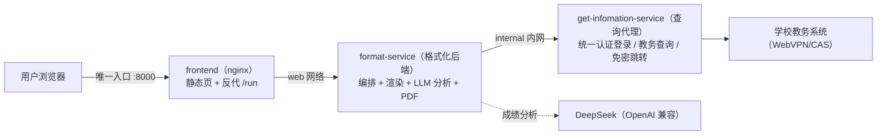

# 教务查询编排 · edu-query-app

> 把固定的 Dify 工作流重写为三容器编排服务：查询代理 + 格式化后端 + 前端，不再依赖 Dify。


[](https://www.python.org/)
[](https://fastapi.tiangolo.com/)
[](https://www.docker.com/)
[](https://nginx.org/)
[](https://redis.io/)
[](https://daringfireball.net/projects/markdown/)

## 目录

- [关于](#关于)
- [技能栈](#技能栈)
- [项目](#项目)
- [架构](#架构)
- [与 Dify 工作流的映射](#与-dify-工作流的映射)
- [当前目标](#当前目标)
- [路线图](#路线图)
- [快速开始](#快速开始)
- [测试](#测试)
- [Kubernetes 迁移就绪](#kubernetes-迁移就绪)
- [仓库结构](#仓库结构)
- [许可](#许可)

## 关于

本仓库把固定的「汕职院教务信息查询」Dify 工作流重写为独立项目，由三个容器组成：`get-infomation-service`（查询代理）、`format-service`（格式化后端）与 `frontend`（前端）。查询代理复用 `../STPT-Query/get-infomation-service` 完成学校统一认证登录与教务查询；格式化后端负责编排固定工作流、成绩/课表渲染、成绩分析 LLM 与 PDF；前端托管原 dify-workflow-api 的完整页面，是唯一对外入口。

| 项目 | 内容 |
| --- | --- |
| 身份 | 教务查询编排服务（替代 Dify 工作流） |
| 方向 | 教育信息化 · 教务数据服务 |
| 方式 | 三容器编排 + 统一身份认证（WebVPN/CAS）+ OpenAI 兼容 LLM |
| 目标 | 不依赖 Dify 地为页面与自动化脚本提供稳定、可扩展的教务查询接口 |

## 技能栈

| 领域 | 内容 |
| --- | --- |
| 后端编排 | Python 3.11 · FastAPI + uvicorn · httpx（登录/跳转/成绩/课表编排与错误分类） |
| 渲染与文档 | Markdown 渲染（1:1 移植原代码节点）· reportlab PDF（内置 CID 中文字体） |
| LLM | OpenAI 兼容协议直连（默认 DeepSeek `deepseek-v4-flash`） |
| 前端 | Nginx 静态页面 + Tailwind CSS 4 品牌令牌（构建期 CLI 编译、运行时零第三方资源）+ 反向代理注入网关令牌 |
| 部署 | Docker Compose 三容器 · 双层网络隔离 · 可选 Redis（多副本） |
| 测试与文档 | pytest 单元测试 · K8s 迁移指引 |

## 项目

| 项目 | 简介 | 技术栈 | 状态 |
| --- | --- | --- | --- |
| [查询代理](https://github.com/Lzf07123/STPT-Query) | 复用 get-infomation-service：统一认证登录、免密跳转、成绩/课表查询 | Python · FastAPI · Redis | 活跃 |
| [格式化后端](format-service/) | 编排固定工作流：查询代理调用、成绩/课表渲染、成绩分析 LLM、PDF | Python · FastAPI · httpx · reportlab | 活跃 |
| [前端](frontend/) | Nginx 托管原 dify-workflow-api 页面并反向代理 /run 等接口 | Nginx | 活跃 |

## 架构



**端口与网络隔离**：仅 `frontend` 映射宿主端口 `8000`；`format-service` 挂 `web` 与 `internal` 两个网络；`get-infomation-service` 只挂 `internal` 内网——宿主与前端都无法直达查询代理，只能通过格式化后端在编排内调用。

## 与 Dify 工作流的映射

| Dify 节点 | 实现 |
| --- | --- |
| 开始节点 | `format-service/app/schema.py::WorkflowRequest` |
| HTTP 节点 ×4 | `format-service/app/pipeline.py` 调查询代理 |
| 代码节点 ×6 | `format-service/app/render.py`（1:1 移植） |
| 成绩分析 LLM | `format-service/app/llm.py` + `prompts.py` |
| 报错解析 LLM ×4 | `format-service/app/classifier.py` 确定性规则 |
| 变量聚合器 | 分支返回值（已消除登录响应泄漏） |
| md_exporter / file_tools | `format-service/app/pdf.py` + 内联 Base64 PDF |
| sys.workflow_run_id | `format-service/app/trace.py::new_run_id` |
| 3 个 END | `format-service/app/schema.py::QueryResult` 单一体 |

## 查询日志与可观测性

`format-service` 为每次查询输出**结构化 JSON 单行日志**（stdout），并保留最近 100 条到
内存环形缓冲（配置 `REDIS_URL` 时写入 `gw:query-logs` 供多副本共享）。日志字段：

| 字段 | 说明 |
| --- | --- |
| `event` | 固定 `query`（限流命中为 `rate_limited`） |
| `time` / `run_id` | 发生时间（含时区）/ 贯穿本次查询的 32 位运行 ID |
| `client_ip` | 客户端地址（`TRUST_PROXY=true` 时取 `X-Forwarded-For` 首段） |
| `username` / `option` | 学号 / 查询项目 |
| `semesters` / `weeks` / `md2pdf` / `check` | 查询参数 |
| `success` / `kind` / `elapsed_ms` | 结果状态、分类与耗时 |

- 日志**不包含**密码 / session / token；白名单字段之外一律丢弃（`app/querylog.py`）。
- 查询日志只写 stdout，不落盘、不引入文件存储/PV，与「编排层无状态」硬规则一致；
  生产环境由集中日志平台（Fluentd / Promtail / 云日志）采集。
- 运维可经网关调用 `GET /query-logs`（与 `/service-status` 同样由 nginx 注入令牌）
  查看最近日志；生产建议经集中日志查询，不长期依赖进程内存。

## 当前目标

| 目标 | 说明 | 期限 |
| --- | --- | --- |
| 真实账号端到端验收 | 用真实学号/密码跑通成绩、课表、成绩分析、PDF 四条链路 | 未定 |

## 路线图

- 近期：真实账号端到端验收；多实例后台任务队列（异步 `/run/{id}` 轮询兼容）
- 中期：查询日志接入集中式日志平台；Prometheus 指标告警；HTTPS 与密钥轮换
- 远期：扩展成绩分析能力与可复用编排方案沉淀

## 快速开始

```bash
cp .env.example .env      # 填写 SERVICE_API_TOKEN / LLM_API_KEY（可选），务必修改 API_TOKEN
docker compose up -d --build
# 浏览器打开 http://127.0.0.1:8000
```

> `PUBLIC_BASE_URL` 为浏览器可访问的对外入口地址，用于生成免密登录 `/jump/go` 与课表下载
> `/get_schedule/export` 链接（本地默认 `http://127.0.0.1:8000`，生产改成公网域名）。

> 前端令牌样式已预编译提交（`frontend/static/style.css`），普通部署无需 npm；修改
> 样式后重新构建：`cd frontend && npm install && npm run build`。

> 前端与 `format-service` 共用固定 `API_TOKEN`（默认 `change-me`），由 nginx 反代时注入 `Authorization` 头，浏览器页面不持有令牌；`SERVICE_API_TOKEN` 必须与 `get-infomation-service` 的 `JWXT_API_TOKEN` 一致；若生产部署在独立服务器，`SERVICE_BASE_URL` 指向已部署的查询代理。

## 测试

```bash
pip install -r requirements-dev.txt
pytest
# 或容器内：
docker build -t format-service:test format-service
docker run --rm -v "$PWD":/app -w /app format-service:test \
  sh -c "pip install -q pytest pytest-asyncio && pytest -q"

# 前端令牌构建（Tailwind CSS 4 同栈，产物自托管）
cd frontend && npm install && npm run build
```

## Kubernetes 迁移就绪

当前不随仓库附带 `k8s/` 清单，但已按未来可迁入 K8s 设计（无状态、环境变量配置、`/health/live` + `/health/ready` 探针、固定 API Token、PDF 内联无 PV）。详见 [docs/kubernetes-migration.md](docs/kubernetes-migration.md)。

## 仓库结构

```text
edu-query-app/
├── format-service/            # 格式化后端（编排 + 渲染 + 分析 + PDF）
│   ├── app/main.py            # HTTP 层：/run /query-logs /health* /service-status
│   ├── app/pipeline.py        # 固定工作流编排
│   ├── app/render.py          # 成绩/课表渲染（原代码节点移植）
│   ├── app/classifier.py      # 确定性异常分类
│   ├── app/llm.py             # OpenAI 兼容 LLM 客户端
│   ├── app/pdf.py             # Markdown→PDF
│   ├── app/prompts.py         # 成绩分析提示词
│   ├── app/schema.py          # 请求/响应模型
│   ├── app/querylog.py        # 查询日志（stdout 结构化 JSON，脱敏）
│   ├── app/trace.py           # run_id 与日志
│   ├── Dockerfile             # python:3.11-slim 镜像
│   └── requirements.txt
├── frontend/                  # 前端（nginx，唯一对外入口）
│   ├── templates/default.conf.template  # 反代 /run 等并注入令牌
│   ├── static/index.html      # 查询页面（Li-Design 令牌重构）
│   ├── static/style.css       # Tailwind CSS 4 编译产物（自托管）
│   ├── static/brand.js        # 品牌单点（名称/slogan/页脚/备案占位）
│   ├── static/image/          # 站点图标
│   ├── src/index.css          # 令牌源（+ app.css，模板实例化）
│   └── package.json           # npm run build 重新编译样式
├── design-system/edu-query-app/   # 项目内品牌方案（BRAND/MASTER，设计事实）
├── tests/                     # pytest（渲染/分类/编排/HTTP/查询日志）
├── docs/kubernetes-migration.md   # K8s 迁移指引
├── Li-Design/                 # Git 子模块：仅设计/README 规范参考，非运行时依赖
├── docker-compose.yml         # 三容器 + 双层网络编排
├── .env.example               # 环境变量模板
├── AGENTS.md                  # 项目协作手册
├── requirements-dev.txt       # 开发依赖
├── pyproject.toml             # 项目元信息 + pytest 配置
└── README.md                  # 项目说明（本文件）
```

## 许可

© 2026 Lzf07123。保留所有权利。
